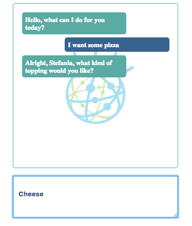
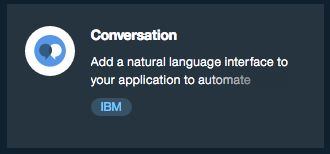
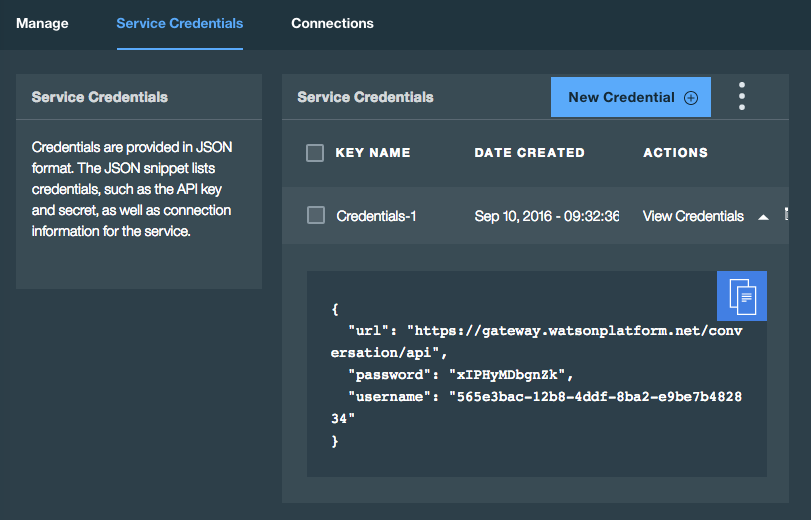
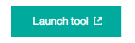
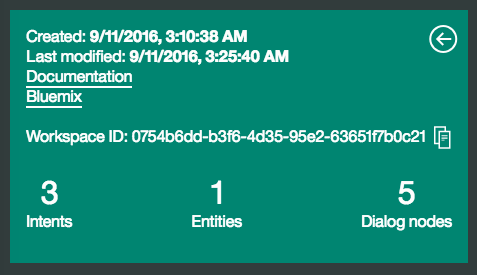
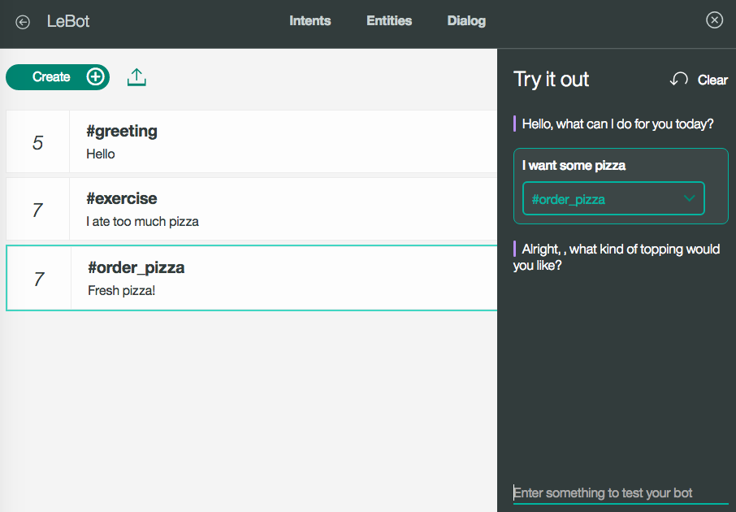
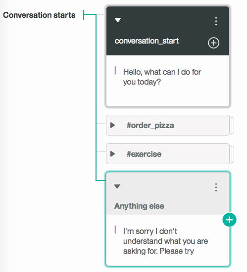

# watson-bot-starter

##Overview
Basic chat bot dialog for working with the [Watson Conversation](https://www.ibm.com/watson/developercloud/conversation.html) service on Bluemix. Once deployed you must navigate to the Watson Conversation service and start to create your intents, entities, and dialogs. You may choose to deploy using the Deploy to Bluemix button below or follow the steps for manually running the app in either Bluemix or locally. 

[](https://bluemix.net/deploy?repository=https://github.com/slkaczma/watson-bot-starter)

Follow this [tutorial](https://www.ibm.com/watson/developercloud/doc/conversation/tutorial_basic.shtml) for learning about Intents, Entities, and Dialog. 

Scroll to the bottom of this README for more information on working with Watson Conversation. **You can import the example dialog from [lebot.json](lebot.json)**



##Run the app on Bluemix
1. If you do not already have a Bluemix account, [sign up here](https://console.ng.bluemix.net/registration/)

2. Download and install the [Cloud Foundry CLI](https://github.com/cloudfoundry/cli/releases) tool

3. Clone the app to your local environment from your terminal using the following command:

  ```
  git clone https://github.com/slkaczma/watson-bot-starter.git
  ```

4. `cd` into this newly created directory

5. Open the `manifest.yml` file and change the `host` value from `botstarter` to something unique.

  The host you choose will determinate the subdomain of your application's URL:  `<host>.mybluemix.net`

6. Connect to Bluemix in the command line tool and follow the prompts to log in.

  ```
  $ cf api https://api.ng.bluemix.net
  $ cf login
  ```
  
7. Create the Watson Conversation service using your Bluemix account and replace the corresponding credentials in your `app.js` file.

  ```
  var conversation = watson.conversation({
      url: 'https://gateway.watsonplatform.net/conversation/api',   
      username: 'CONVERSATION_USERNAME',   // Set to your conversation username
      password: 'CONVERSATION_PASSWORD',   // Set to your conversation password
      version_date: '2016-07-11',
      version: 'v1'
  });
  ```

8. Once you have a workspace/conversation created, update your Workspace ID:
   ```
   var workspace = 'WORKSPACE_ID'; // Set to your Conversation workspace ID
   ```
  
9. Push the app to Bluemix.

  ```
  $ cf push
  ```

##Run the app locally
1. If you do not already have a Bluemix account, [sign up here](https://console.ng.bluemix.net/registration/)

2. Download and install the [Cloud Foundry CLI](https://github.com/cloudfoundry/cli/releases) tool

3. Clone the app to your local environment from your terminal using the following command:

  ```
  git clone https://github.com/slkaczma/watson-bot-starter.git
  ```

4. `cd` into this newly created directory

5. Log into your Bluemix account and navigate to the Catalog.

6. Create the Watson Conversation service using your Bluemix account and replace the corresponding credentials in your `app.js` file. 

  ```
  var conversation = watson.conversation({
      url: 'https://gateway.watsonplatform.net/conversation/api',   
      username: 'CONVERSATION_USERNAME',   // Set to your conversation username
      password: 'CONVERSATION_PASSWORD',   // Set to your conversation password
      version_date: '2016-07-11',
      version: 'v1'
  });
  ```
  
7. Once you have a workspace/conversation created, update your Workspace ID:
   ```
   var workspace = 'WORKSPACE_ID'; // Set to your Conversation workspace ID
   ```

8. Start your app locally with the following commands

  ```
  npm install
  ```
  ```
  node app
  ```
  
##Start Creating Conversations
 1. Create an instance of the Watson Conversation service.
    

 2. Copy the credential into app.js. See above.
    

 3. Click on the service tile. Open the service dashboard using the Launch button under the Manage tab.
    

 4. Create a new workspace. Select the three dots and select View details to get the Workspace ID for your bot.
    

 5. Click on the newly created workspace to start creating intent, entities, and dialog. 
    

 6. Always make sure to have a conversation_start condition as the first box in your dialog. 
    
